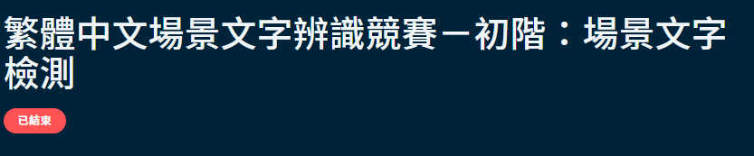
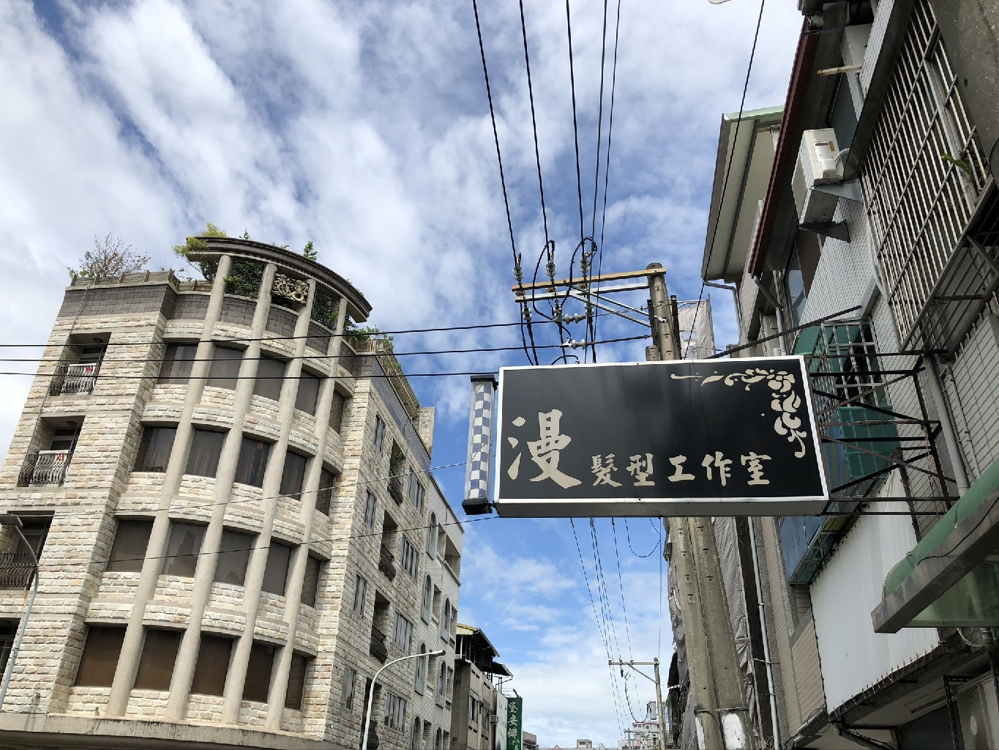
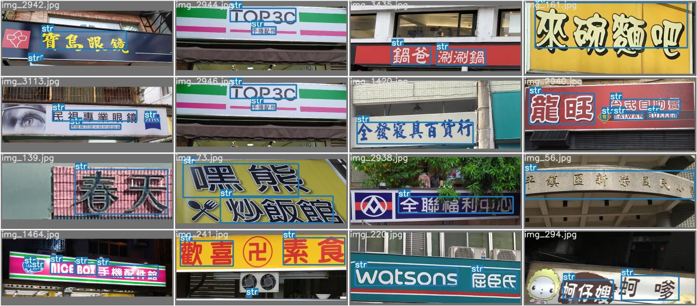

# 2021 AI Cup Preliminary: Scene Text Detection


## Description


這是參加"[繁體中文場景文字辨識競賽－初階：場景文字](https://tbrain.trendmicro.com.tw/Competitions/Details/13)"的佳作(10/341)紀錄。

本次賽事目標即為定位畫面中肉眼可識的文字位置，場景為台灣市區街景，期望參賽者利用機器學習/深度學習技術，嘗試與開發適當的模型，
以確偵測台灣街景畫面中的文字區域。


## Environment

- Windows 10 
- GeForce RTX 3090 GPU
- python3.8.6
- torch=1.8.1
- torchvision=0.9.1 


## Installation
- 利用"[YOLOv5](https://github.com/ultralytics/yolov5)"來做物件偵測。

1. Install virtual environment:
	```shell
	virtualenv -p python3 exp2 # establish
	.\exp2\Scripts\activate # activate 
	```

2. Clone this repo:
	```shell
	git clone https://github.com/josephhou626/AIM_Scene_Detection.git # clone
	```

3. Install torch and torchvision:
	```shell
	pip3 install torch==1.8.1+cu111 torchvision==0.9.1+cu111 torchaudio===0.8.1 -f https://download.pytorch.org/whl/torch_stable.html
	```

4. Install dependencies:

   ```shell
   cd yolov5
   pip install -r requirements.txt
   ```

## Dataset
TBrain 平台提供的場景文字資料集,場景中可能出現多型態文字、多國文字、傾斜招牌文字、不同尺寸文字、外物遮蔽、類文字圖案紋理干擾、光線與陰影等。
- 訓練集 4000 張 有標籤
- 測試集 1000 張 （Public Dataset) 無標籤
- 測試集 2500 張 （Private Dataset) 無標籤

**放入資料集的images和按照yolov5格式的box座標**
   ```
   datasets/images
   |-----train (put image here)
   |-----val (put image here)
   |-----test (put image here)
   ```

   ```
   datasets/labels
   |-----train (put corresponding txt here)
   |-----val (put corresponding txt here)
   ```


取自"[繁體中文場景文字辨識競賽官網](https://tbrain.trendmicro.com.tw/Competitions/Details/13)"。

## Data Augmentation

我們採用兩種影像增強的方式對訓練集做資料擴增。
1. Contrast Limited Adaptive Histogram Equalization (CLAHE)


**Example**

<div id="image-table">
    <table>
	    <tr>
    	    <td style="padding:10px">
        	    
      	    </td>
            <td style="padding:10px">
            	
            </td>
        </tr>
    </table>
</div>


2. White Balance (WB)


## Train
- Pre-trained weight，我們是採用yolov5x6。


- Download yolov5 pretrained weight : "[yolov5x6](https://github.com/ultralytics/yolov5/releases)"


- Training commands :
	```
	python train.py --data data\SceneDetection.yaml --name aim_scene_dectection --batch-size 16 --multi-scale

	```

- The training results will be placed in 

	```shell
	runs\train\aim_scene_dectection
	```


## Test
- Testing commands :
	```
	python detect.py  --name aim_scene_dectection --save-txt
	```

- The testing results will be placed in 

	```shell
	runs\detect\aim_scene_dectection
	```


## Results





## Reference
- "[YOLOv5](https://github.com/ultralytics/yolov5)"


