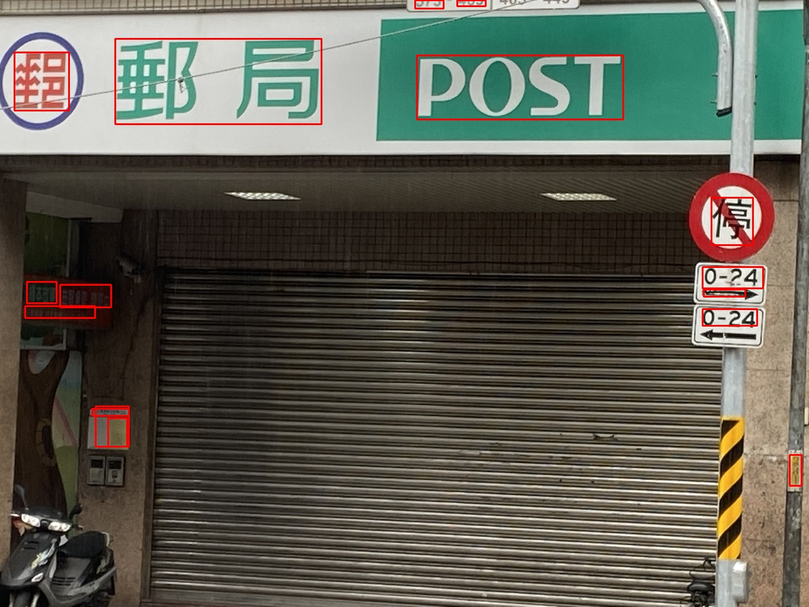

# AIM_Scene_Detection


## Description

這是參加"[繁體中文場景文字辨識競賽－初階：場景文字](https://tbrain.trendmicro.com.tw/Competitions/Details/13)"的佳作紀錄。


## Environment

- windows 10 
- RTX 3090 GPU
- torch=1.8.1
- torchvision=0.9.1 


## Installation
我們的模型採用"[YOLOv5](https://github.com/ultralytics/yolov5)"


1. Clone this repo:
	```shell
	git clone https://github.com/josephhou626/AIM_Scene_Detection.git # clone
	```

2. Install dependencies:

   ```shell
   cd yolov5
   pip install -r requirements.txt
   ```

## Dataset

取自"[繁體中文場景文字辨識競賽官網](https://tbrain.trendmicro.com.tw/Competitions/Details/13)"。

## Train


```
python detection.py
```


## Test
pretrained weight :  


```
python detection.py
```

## Results





